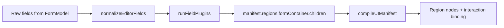
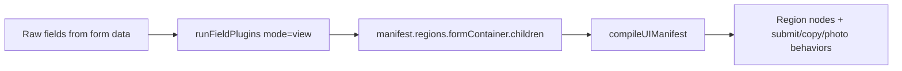

An attempt to create a browser-based HTML canvas app that can be used to generate forms for data collection.

Your wiring function should:

React to actions → delegate to domain/application layer → update UI

UI Events → Dispatcher → Commands/Services → Store → UI

## Architecture Responsibility Map

### UI builder / renderer
- Manifests define screen structure and field presentation.
- Editor field normalization is split from manifest construction (`normalizeEditorFields` → plugin pass).
- Manifest compiler builds root nodes and regions.
- UI factory instantiates node types and connects command actions.
- Engine rendering now goes through a UI renderer adapter contract: `renderManifest(manifest)`, `updateRegion(regionId, children)`, `invalidate()`.
- A minimal manifest DSL provides shape/default helpers only (`defineManifest`, `containerRegion`, `buttonNode`) to reduce repetition and authoring friction.

Key files:
- `public/components/manifests/createFormManifest.js`
- `public/components/manifests/manifestDsl.js`
- `public/components/manifests/editor/fieldNormalization.js`
- `public/components/manifests/viewFormManifest.js`
- `public/components/createForm/formBuilderAdapters.js` (`createCanvasUiRendererAdapter`, `createDomUiRendererAdapter`)
- `public/components/uiManifestCompiler.js`
- `public/components/factory/baseUiFactory.js`

### Interaction manager
- Selection, drag-and-drop reorder, and builder interaction state are handled by controllers.
- Photo preview behavior (source sync, brightness slider reveal/update) is handled by `PhotoPreviewController`.
- Editor interaction state is centralized in `EditorState` (`mode`, `selectedFieldId`, `draggingFieldId`, `previewInsertionBeforeFieldId`).
- `ReorderFeature` writes drag/preview state into `EditorState`; `FormBuilderInteractionController` reads state for visuals and writes selection changes.

Key files:
- `public/components/createForm/editorState.js`
- `public/components/createForm/reorderFeature.js`
- `public/controllers/formBuilderInteractionController.js`
- `public/controllers/formReorderController.js`
- `public/controllers/formBuilderFieldBindingController.js`
- `public/controllers/photoPreviewController.js`

### Plugin coordinator
- Field transformation is done through mode-based plugin pipelines.
- Create/edit selection controls (drag handle + delete button) are injected as an editor plugin.
- Plugin ordering and enablement is centralized in one config.
- `FormBuilderEngine` exposes runtime plugin registration (`registerPlugin`, `unregisterPlugin`, `getRegisteredPlugins`).
- Official plugin shape: `{ name, transform(field, context) }`.

Key files:
- `public/components/fieldPlugins/fieldPluginConfig.js`
- `public/components/fieldPlugins/fieldPluginRegistry.js`
- `public/components/fieldPlugins/runFieldPlugins.js`
- `public/components/fieldPlugins/editor/injectSelectionControlsPlugin.js`
- `public/components/fieldPlugins/editor/selectionControlsStyle.js`

### CreateForm orchestration
- `CreateForm` now coordinates modules instead of owning all logic directly.
- Form data operations are delegated to `FormModel`.
- Command names/registration, field defaults, field ID resolution, photo binding, and editor interaction are extracted into dedicated helpers.

### Engine vs app layer
- `FormBuilderEngine` is the reusable builder core. It owns editor state, model, controllers, feature coordinators, and render lifecycle.
- `CreateForm` / `EditForm` are app adapters. They provide persistence and dispatch strategy by overriding engine hooks.
- Engine emits high-level events and invokes hooks, but does not dispatch actions, call sockets, or assume user/persistence models.

Hook contract:
- `handleSaveRequest(normalizedForm)` → app decides add/update dispatch + submit policy.
- `handleBrightnessPersistRequest({ fieldId, normalizedForm })` → app decides metadata persistence strategy.

Key files:
- `public/components/createForm/formBuilderEngine.js`
- `public/components/createForm.js`
- `public/components/editForm.js`
- `public/models/formModel.js`
- `public/components/createForm/createFormCommands.js`
- `public/components/createForm/createFormFieldFactory.js`
- `public/components/createForm/createFormFieldResolver.js`
- `public/components/createForm/createFormPhotoPreviewBinder.js`
- `public/components/createForm/createFormEditorInteraction.js`

### Create/Edit render pipeline

- `normalizeEditorFields` applies mode rules plus selection/dragging decoration.
- `runFieldPlugins` injects editor/view behavior (selection controls, photo preview, copy button, submit action) by mode.
- The final children list is written to the manifest, compiled into nodes, then controllers bind interactions.

### View render pipeline

- View mode does not apply editor selection/dragging normalization.
- View plugins inject copy buttons, submit action normalization, and photo preview controls.
- The transformed field list is written to the manifest and compiled into runtime nodes.

### Mode comparison

| Concern | Create/Edit | View |
| --- | --- | --- |
| Base field normalization | `normalizeEditorFields` (mode + selection + dragging) | None (raw fields) |
| Selection controls | Injected (`drag-handle-*`, `delete-*`) | Not injected |
| Photo behavior | Photo preview plugin enabled | Photo preview plugin enabled |
| Copy button injection | Disabled by mode config | Enabled by mode config |
| Submit action normalization | Not applied | Applied (`ensureSubmitActionPlugin`) |
| Manifest target region | `regions.formContainer.children` | `regions.formContainer.children` |

## Data Entry, Persistence, and Retrieval Flow

### 1. Entering Information (Frontend)
- Users fill out a form rendered on the HTML canvas.
- The UI is generated from a manifest, which defines fields and layout.
- When the user submits the form, only the raw input fields and formId are sent to the backend:
  - `{ formId, fields }`
- The frontend dispatches a minimal payload via the command registry and action dispatcher.

### 2. Saving Information (Backend)
- The backend receives the submission event.
- It validates the payload and persists the data in DynamoDB:
  - Each form submission is saved in a domain-partitioned table (e.g., `form_results_{formId}`).

UI → articleService → articleRepository (client) → socket → server → articleRepository (server) → DynamoDB

UI → formService → formRepository (client) → socket → formRepository (server) → DynamoDB

dispatcher → service (pure) → store.apply(nextState) → diff → UI

to do:
A balanced recommendation
Based on your architecture goals, your interest in pipelines, and your desire for extensibility, yes — field‑level diffs are a good idea, but only if you implement them in a way that doesn’t explode complexity.
The sweet spot is:
- Keep the store simple
- Add a diff engine that can be swapped or extended
- Emit diffs only when needed
- Don’t force the UI to use them unless it wants to
This gives you power without locking you into complexity.

README — Architecture Overview
This project is a modular, domain‑driven application built around a unified UI engine, a socket‑driven API layer, and a clean separation between client, server, repositories, commands, and domain DB modules.
The system is designed for extensibility, pipeline‑driven rendering, and plugin‑ready domain logic.

1. High‑Level Architecture
The system is composed of three major layers:
Client (UI Engine + Commands + Repositories)
- A custom canvas‑based UI engine with:
- Declarative layout
- Pipeline‑driven rendering
- Scene graph + diff‑based updates
- Command registry for user intent
- Domain‑specific stores (Forms, Articles, Results)
- Client repositories communicate with the server via Socket.IO
- Commands represent user intent, not data fetching
- UI is fully modular and plugin‑ready
Server (Socket Handlers + Repositories + DB Modules)
- Socket handlers expose domain events:
- form.*
- formResults.*
- article.*
- auth.*
- Server repositories wrap DB modules
- DB modules wrap DynamoDB operations
- Each domain is isolated and testable
Database (DynamoDB)
- Tables:
- forms_table
- form_results_table
- articles_table
- sessions_table
- Each domain has its own DB module:
- formDB.js
- formResultsDB.js
- articleDB.js
- authDB.js

2. Folder Structure
Client
public/
  app.js                     # Bootstrap (clean)
  socketClient.js
  commands/
    auth/
      registerAuthCommands.js
    forms/
      registerFormCommands.js
    articles/
      registerArticleCommands.js
    reports/
      registerReportCommands.js
    index.js                 # Aggregates all commands
  repositories/
    formRepository.js
    formResultsRepository.js
    articleRepository.js
    authRepository.js
  services/
    articleService.js
  events/
    formStore.js
    UiStateStore.js
    actions.js
    sceneInputSystem.js
  components/
    loginScreen.js
    ...
  managers/
    canvas.js
    layOut.js
    focusManager.js
  renderers/
    containerRenderer.js
    layOutRenderer.js
  setUp/
    canvasSystemBuilder.js
    renderSystemBuilder.js
    uiEngine.js
    wireSystemEvents.js
  strategies/
    engineRootLayout.js
  utils/
    register.js
    normalizeFields.js

Server
server/
  server.js
  socket/
    authHandlers.js
    formHandlers.js
    formResultsHandlers.js
    articleHandlers.js
  repositories/
    authRepository.js
    formRepository.js
    formResultsRepository.js
    articleRepository.js
  db/
    dynamoClient.js
    authDB.js
    formDB.js
    formResultsDB.js
    articleDB.js

	3. Data Flow
UI → Command → Repository → Socket → Server Handler → Repository → DB Module → DynamoDB
Example: Saving an article
- User clicks “Save”
- UI triggers command "article.save"
- Command calls articleRepository.updateArticle()
- Repository emits socket.emit("article.update")
- Server receives event in articleHandlers.js
- Server repository calls articleDB.updateArticle()
- DynamoDB updates the item
- Server responds with "article.updateResponse"
- Client updates UI via articleService.updateArticle()
This pipeline is consistent across all domains.

4. Domain‑Driven Modules
Each domain has:
- DB module (DynamoDB operations)
- Server repository (wraps DB)
- Socket handler (exposes events)
- Client repository (wraps socket)
- Commands (user intent)
- Store (UI state)
- UI components (rendering)
This ensures:
- Isolation
- Testability
- Extensibility
- Predictability

5. Commands
Commands represent user intent, not data fetching.
Examples:
- "LOGIN"
- "form.submit"
- "article.save"
- "report.save"
Commands are registered in:
public/commands/
registerAllCommands({
  commandRegistry,
  context,
  store,
  system,
  socket,
  showToast
});
6. Repositories
Repositories abstract communication with the server.
They emit socket events and return promises.
Example:
articleRepository.updateArticle(articleId, updates)
This keeps UI logic clean and domain‑focused.

7. UI Engine
The UI engine is a custom canvas‑based system with:
- Scene graph
- Layout manager
- Renderer registry
- Event bus
- Pipeline for diff‑based updates
- Plugin system
- Command registry
- Screen router
This allows:
- Declarative UI
- High performance
- Extensibility
- Custom components
- Real‑time updates

8. Server Architecture
The server is event‑driven:
- Each domain has its own socket handler
- Each handler calls a domain repository
- Each repository calls a DB module
- DB modules interact with DynamoDB
This keeps the server clean and modular.

9. Authentication
Authentication uses:
- UserAuth for password hashing + verification
- authDB.js for session storage
- authRepository.js for server abstraction
- registerAuthCommands.js for login UI
Session tokens are stored in:
sessions_table
10. Extending the System
To add a new domain (e.g., “Projects”):
- Create projectDB.js
- Create projectRepository.js (server)
- Create projectHandlers.js
- Create projectRepository.js (client)
- Create registerProjectCommands.js
- Add UI components + store logic
The architecture scales naturally.

11. Why This Architecture Works
- Domain‑driven: Each domain is isolated and self‑contained
- Pipeline‑driven UI: Efficient rendering and predictable updates
- Command‑based user intent: Clean separation between UI and logic
- Repository pattern: Abstracts communication and storage
- Socket‑driven API: Real‑time updates and low latency
- Modular server: Easy to extend and maintain
- Plugin‑ready: UI engine supports custom components and behaviors
This architecture is built for:
- Extensibility
- Maintainability
- Real‑time collaboration
- Complex UI interactions
- Multi‑domain systems

🛠 Step 2 — Move Active Logic Into Commands

Your current command:

commandRegistry.register("form.submit", (payload) => {
  const activeForm = store.getActiveForm();

That’s correct.

All state resolution belongs here.

Do the same for delete:

commandRegistry.register("form.delete", () => {
  const state = store.getState();
  const activeId = state.activeFormId;
  if (!activeId) return;

  const form = state.forms[activeId];

  formRepository.delete(form.formId);

  store.apply(prev => {
    const nextForms = { ...prev.forms };
    delete nextForms[activeId];

    return {
      ...prev,
      forms: nextForms,
      activeFormId: null
    };
  });
});

Now delete is fully self-contained.

🛠 Step 3 — Store.apply Should Accept Updater Function

Change store to this:

apply(updater) {
  const prev = this.state;
  const next = typeof updater === "function"
    ? updater(prev)
    : updater;

  this.state = Object.freeze(next);

  const diff = this.computeDiff(prev, next);

  for (const { listener } of this.listeners) {
    listener({ state: this.state, diff });
  }

  this.eventBus?.emit("formStore:changed", { state: this.state, diff });
}

Now commands can safely update state without stale snapshots.

🛠 Step 4 — Remove Domain Logic From wireSystemEvents

wireSystemEvents should ONLY handle routing:

commandRegistry.register("dashboard.show", (forms) => {
  formService.setForms(forms);
  router.replace(new DashBoardScreen(...));
});

No repository.
No store mutation.
No domain rules.

🧠 Final Clean Architecture

You now have:

UI Layer

Screens

Manifest

bindCommands

Application Layer

commandRegistry

registerFormCommands

registerArticleCommands

Infrastructure Layer

Repositories

Socket

API

State Layer

FormStore (immutable)

🚀 Final Result

You get:

Single source of truth

Single mutation entry (store.apply)

No dispatcher redundancy

No UI → store direct coupling

Clean use-case boundaries

Easy undo/redo later

Easy logging

Easy permission system

Easy offline support

🔥 The Big Rule Going Forward

Screens never talk to repositories.

Screens never mutate store.

Screens only execute commands.

Commands:

Read store

Call repositories

Apply new state

If You Trust Me — Read This Next (Very Important)

If this system will live longer than 1 year, I strongly recommend one more improvement that will prevent 80% of future bugs:

👉 Introduce Command Middleware Pipeline

It is small to add now.

Painful to add later.

If you want, say:

show middleware pipeline design

and I will show the cleanest possible version for your architecture.

My Strongest Question (Answer This Honestly)

This is extremely important.

Are you planning to eventually support:

👉 Multiple independent apps running inside this runtime
(example: dashboard module + form designer module + report module loaded separately)?

Yes or No.

our New Runtime Flow

You are moving to this model:

Bootstrap
   ↓
Data Fetch
   ↓
State Store Initialize
   ↓
Router Navigation
   ↓
Screen Lifecycle
   ↓
Reactive Rendering

If You Want The Most Powerful Insight I Can Give You

If this system is going to live long term, there is one hidden structural weakness in your current design that will eventually cause debugging nightmares under async navigation + pipeline invalidation.

It is subtle but very real.

If you want, say:

show hidden runtime bug risk

and I will show it.

Bootstrap Layer
↓
Service / Repository Layer
↓
Command Layer (Use Cases)
↓
Router Layer
↓
Screen Lifecycle Layer
↓
Reactive Store Layer
↓
Renderer Pipeline

Screens are constructed by router
Navigation is controlled by router
Domain behavior is executed by command registry
State changes happen through store.apply()
There is ONE remaining structural weakness in your system that will only appear under:

✅ Fast navigation
✅ Async bootstrap loading
✅ Pipeline invalidation race

It is subtle but very real.

If you want to make this engine bulletproof, say:

show race-safe runtime kernel pattern

and I will show the protection design used in real UI runtimes.