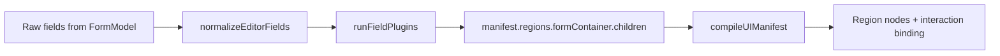
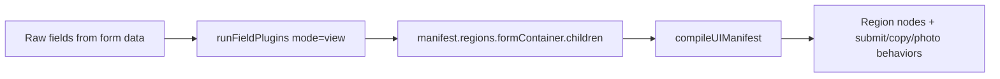

An attempt to create a browser-based HTML canvas app that can be used to generate forms for data collection.

## Architecture Responsibility Map

### UI builder / renderer
- Manifests define screen structure and field presentation.
- Editor field normalization is split from manifest construction (`normalizeEditorFields` → plugin pass).
- Manifest compiler builds root nodes and regions.
- UI factory instantiates node types and connects command actions.
- Engine rendering now goes through a UI renderer adapter contract: `renderManifest(manifest)`, `updateRegion(regionId, children)`, `invalidate()`.

Key files:
- `public/components/manifests/createFormManifest.js`
- `public/components/manifests/editor/fieldNormalization.js`
- `public/components/manifests/viewFormManifest.js`
- `public/components/createForm/formBuilderAdapters.js`
- `public/components/createForm/formBuilderAdapters.js` (`createCanvasUiRendererAdapter`, `createDomUiRendererAdapter`)
- `public/components/uiManifestCompiler.js`
- `public/components/factory/baseUiFactory.js`

### Interaction manager
- Selection, drag-and-drop reorder, and builder interaction state are handled by controllers.
- Photo preview behavior (source sync, brightness slider reveal/update) is handled by `PhotoPreviewController`.
- Editor interaction state is centralized in `EditorState` (`mode`, `selectedFieldId`, `draggingFieldId`, `previewInsertionBeforeFieldId`).
- `ReorderFeature` writes drag/preview state into `EditorState`; `FormBuilderInteractionController` reads state for visuals and writes selection changes.

Key files:
- `public/components/createForm/editorState.js`
- `public/components/createForm/reorderFeature.js`
- `public/controllers/formBuilderInteractionController.js`
- `public/controllers/formReorderController.js`
- `public/controllers/formBuilderFieldBindingController.js`
- `public/controllers/photoPreviewController.js`

### Plugin coordinator
- Field transformation is done through mode-based plugin pipelines.
- Create/edit selection controls (drag handle + delete button) are injected as an editor plugin.
- Plugin ordering and enablement is centralized in one config.
- `FormBuilderEngine` exposes runtime plugin registration (`registerPlugin`, `unregisterPlugin`, `getRegisteredPlugins`).
- Official plugin shape: `{ name, transform(field, context) }`.

Key files:
- `public/components/fieldPlugins/fieldPluginConfig.js`
- `public/components/fieldPlugins/fieldPluginRegistry.js`
- `public/components/fieldPlugins/runFieldPlugins.js`
- `public/components/fieldPlugins/editor/injectSelectionControlsPlugin.js`
- `public/components/fieldPlugins/editor/selectionControlsStyle.js`

### CreateForm orchestration
- `CreateForm` now coordinates modules instead of owning all logic directly.
- Form data operations are delegated to `FormModel`.
- Command names/registration, field defaults, field ID resolution, photo binding, and editor interaction are extracted into dedicated helpers.

### Engine vs app layer
- `FormBuilderEngine` is the reusable builder core. It owns editor state, model, controllers, feature coordinators, and render lifecycle.
- `CreateForm` / `EditForm` are app adapters. They provide persistence and dispatch strategy by overriding engine hooks.
- Engine emits high-level events and invokes hooks, but does not dispatch actions, call sockets, or assume user/persistence models.

Hook contract:
- `handleSaveRequest(normalizedForm)` → app decides add/update dispatch + submit policy.
- `handleBrightnessPersistRequest({ fieldId, normalizedForm })` → app decides metadata persistence strategy.

Key files:
- `public/components/createForm/formBuilderEngine.js`
- `public/components/createForm.js`
- `public/components/editForm.js`
- `public/models/formModel.js`
- `public/components/createForm/createFormCommands.js`
- `public/components/createForm/createFormFieldFactory.js`
- `public/components/createForm/createFormFieldResolver.js`
- `public/components/createForm/createFormPhotoPreviewBinder.js`
- `public/components/createForm/createFormEditorInteraction.js`

### Create/Edit render pipeline

- `normalizeEditorFields` applies mode rules plus selection/dragging decoration.
- `runFieldPlugins` injects editor/view behavior (selection controls, photo preview, copy button, submit action) by mode.
- The final children list is written to the manifest, compiled into nodes, then controllers bind interactions.

### View render pipeline

- View mode does not apply editor selection/dragging normalization.
- View plugins inject copy buttons, submit action normalization, and photo preview controls.
- The transformed field list is written to the manifest and compiled into runtime nodes.

### Mode comparison

| Concern | Create/Edit | View |
| --- | --- | --- |
| Base field normalization | `normalizeEditorFields` (mode + selection + dragging) | None (raw fields) |
| Selection controls | Injected (`drag-handle-*`, `delete-*`) | Not injected |
| Photo behavior | Photo preview plugin enabled | Photo preview plugin enabled |
| Copy button injection | Disabled by mode config | Enabled by mode config |
| Submit action normalization | Not applied | Applied (`ensureSubmitActionPlugin`) |
| Manifest target region | `regions.formContainer.children` | `regions.formContainer.children` |
